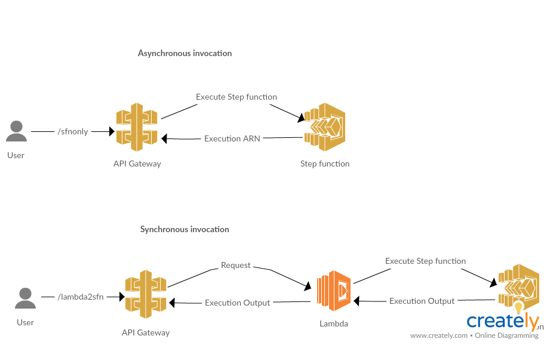

## API gateway and step funtions integration example

The goal of this project is to show how to integrate [AWS Stepfunctions](https://aws.amazon.com/step-functions/) with [AWS API Gateway](https://aws.amazon.com/api-gateway/) using [AWS SAM](https://github.com/awslabs/serverless-application-model). That is doing [this](https://docs.aws.amazon.com/step-functions/latest/dg/tutorial-api-gateway.html) using AWS SAM and [cloud formation](https://aws.amazon.com/cloudformation/).

Using API gateway to invoke lambda function using SAM is very trivial, but to get the same working with step functions needs some work.

### Architecture

Invoking stepfunctions via API gateway can be done in 2 ways, Synchronously and Asynchronously. In synchronous invokation API gatway returns actual result to the user, which in async invokation mode an execution ARN is returned. Execution ARN can be used to access the result one the execution is completed. The following diagram shows how above said invokations work.



### Deploy the sample template
For uploading all the deployment artifacts [create a s3 bucket](https://docs.aws.amazon.com/AmazonS3/latest/gsg/CreatingABucket.html) or use an existing one. Export the name of the bucket as CF_BUCKET_NAME env variable

```
export CF_BUCKET_NAME=<bucket name>
```

This repo has a ```stack.yaml``` file which is a AWS SAM cloud formation template. Assuming that your [awscli](https://aws.amazon.com/cli/) is properly configured use the following command to deploy the stack

```
chmod +x deploy.sh
./deploy.sh
```

This should deploy the stack in your AWS cloud account.

To inspect the cloud formation stack: log into AWS console > search for cloud formation page > you should find ```api-sfn-proto``` stack within this page.

To inspect the stack through SAM console: log into AWS console > search for lambda functions page > click on applications > you should find ```api-sfn-proto``` SAM model within this page.

### Known issues
- In synchronous mode if the step function execution time is more than 25-30 seconds, [API gateway integration timeout occurs](https://docs.aws.amazon.com/apigateway/latest/developerguide/limits.html).
